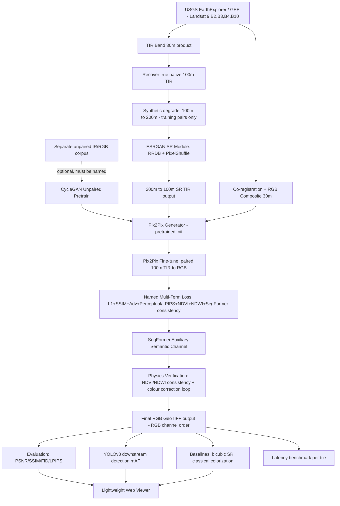

# ISRO Problem Statement: Infrared Image Colorization & Enhancement for Improved Object Interpretation

## Problem Overview
Build a complete deep-learning pipeline (with a lightweight web demo) that:
1. **Objective 1**: Enhances raw IR satellite imagery via super-resolution/sharpening (recovering faint edges/textures lost to low native thermal resolution)
2. **Objective 2**: Colorizes the enhanced IR image into a realistic RGB representation, constrained by land-cover semantics so colors are not hallucinated
3. **Objective 3**: Demonstrates that the colorized+enhanced output measurably improves downstream object detection/segmentation versus raw IR

## Revision Note
This version merges two independently-developed pipelines (this team's original draft + a second team-member's proposed flow) and resolves every point where they disagreed or where either one had an unsupported claim. Where the merge changed something material from a first draft, it's called out explicitly below — a panel respects "we caught and fixed this" far more than a document that hides its own revision history.

## Reality Check Before Architecture (read this before building anything)

These are not stylistic notes — each one changes a design decision below. Skipping past them will produce a pipeline that looks complete but fails the first time someone asks "why."

1. **Landsat 8/9 already gives you paired, co-registered IR + RGB.** Band 10/11 (TIRS, thermal) and Bands 2/3/4 (OLI, visible) come from the same satellite, same overpass, same scene, and are delivered already ortho-rectified to a common UTM grid in Collection 2 Level-1/Level-2 products. This is a genuine asset — you are NOT in the usual "no paired data exists" situation that most IR-colorization papers complain about.

2. **CycleGAN has exactly one legitimate role here: unpaired pretraining, not the final translation model.** CycleGAN exists to learn translation when source and target *can't* be aligned. You have alignment — so CycleGAN must never be the model producing your final output. Its one defensible use is as a **pretraining stage on a genuinely separate, larger unpaired IR/RGB corpus**, to give the generator broad color priors before the smaller paired Landsat set fine-tunes it via Pix2Pix. This only works — and only adds value over skipping straight to Pix2Pix — **if a real unpaired data source is identified and named.** If your team cannot name the actual unpaired thermal corpus and the actual unpaired RGB/land-cover corpus you'll pretrain on, cut this stage; running CycleGAN on the same Landsat tiles with pairing artificially ignored adds engineering complexity with no informational benefit, and a technical judge will ask exactly this question.

3. **The real native thermal resolution is 100m — not the 30m delivered product, and "200m" is a synthetic training target, not a sensor fact.** USGS delivers TIRS thermal bands resampled to 30m pixel spacing, but the actual acquisition resolution is 100m; the 30m product does not contain genuine 30m-scale thermal information. This means there are two distinct operations in this pipeline, and they must not be described as one smooth cascade:
   - **30m delivered product → 100m**: recovering the sensor's *true* native resolution from an over-resampled product. This is a real, physically meaningful target.
   - **100m → 200m (synthetic degradation)**: deliberately blurring/downsampling *below* native resolution to create a controlled low-res/high-res training pair, since no naturally-occurring 200m thermal/100m thermal pair exists for the same scene. This is a standard self-supervised SR training trick — valid, but must be labeled as synthetic, not presented as "discovering" a real 200m sensor characteristic.
   - The trained SR network's job, stated precisely: learn to invert the synthetic 200m→100m degradation, then apply that learned inversion to real-world 100m inputs (recovered from the 30m product) to produce sharpened, detail-enhanced 100m-equivalent thermal imagery. This is the correct and defensible version of "super-resolution" for this dataset — get this framing right in the report, because the imprecise version ("100m is native, ×6.67 to 200m") is the kind of statement that a reviewer who has touched Landsat data will catch immediately.

4. **Adversarial loss and "no hallucination" actively fight each other.** A vanilla GAN discriminator rewards outputs that *look* plausible, with zero awareness of whether they're *true*. The loss function must be engineered against this from day one — and "7-term physics loss" is meaningless as a phrase unless every term is named and justified (see Stage 5, `losses.py`). If your team can't list all seven terms on request, don't claim seven; claim however many you can actually defend.

5. **FID needs a large sample to mean anything.** Standard FID computation is only statistically stable with on the order of low thousands of images; on a few hundred satellite tiles the number will swing significantly between runs. Report it because the brief requires it, paired with the tile count used, and treated as directional rather than a precise score.

6. **LPIPS belongs alongside PSNR/SSIM/FID, not instead of them.** PSNR/SSIM measure pixel/structural fidelity but correlate weakly with human-perceived realism; LPIPS (a learned perceptual similarity metric) closes that gap and is now standard practice alongside FID for exactly this kind of generative image task.

7. **"Realistic colorization" needs a definition of ground truth, and Landsat gives you a real one — use it.** Since you already have true RGB bands for the same scene, predicted color is supervised directly against actual color, pixel-by-pixel. This removes the usual ambiguity in colorization literature (which often lacks real-color ground truth). Every design decision below should exploit this rather than work around it.

8. **A baseline comparison is non-negotiable.** PSNR/SSIM/FID/LPIPS/mAP numbers mean nothing in isolation. Without bicubic-upscaling and classical (non-DL) colorization baselines reported alongside the trained model's numbers, there is no evidence the deep learning approach earned its complexity — only that it produced output.

9. **Output channel order: RGB, not BGR, at the final deliverable stage.** OpenCV's internal default is BGR, and it's fine to work in BGR during intermediate processing if that's the team's tooling — but the final GeoTIFF deliverable must be RGB-ordered, or every downstream GIS viewer (QGIS, Rasterio-based tools, ArcGIS) will render the "realistic colorization" with red and blue visibly swapped. This is a one-line fix; catching it now avoids a demo where water looks orange.

## Architecture



## Project Structure

```
IR-Colorization/
├── backend/
│   ├── data_acquisition/
│   │   ├── config.py                   # AOI bounding boxes, date ranges, band IDs (B2,B3,B4,B10)
│   │   ├── landsat_downloader.py       # USGS M2M API / GEE pull of L9 scenes
│   │   └── scene_inventory.py          # Cloud-cover filtering, scene metadata catalog
│   ├── preprocessing/
│   │   ├── coregistration.py           # Verify/resample thermal vs OLI band grids to common patch grid
│   │   ├── radiometric_calibration.py  # DN -> radiance -> brightness temp (TIRS), DN -> reflectance (OLI)
│   │   ├── rgb_composite.py            # B2+B3+B4 -> RGB composite, 30m
│   │   ├── native_resolution_recovery.py  # 30m delivered TIR -> true 100m native (NOT a synthetic step)
│   │   ├── synthetic_degradation.py    # 100m -> 200m, blur+downsample, TRAINING PAIRS ONLY, labeled as synthetic
│   │   ├── tiling.py                   # Co-registered 256x256 patch extraction (RGB + TIR pairs)
│   │   ├── ndvi_water_mask.py          # NDVI, NDWI, NDBI for physics verification step
│   │   └── dataset_split.py            # Train/val/test split by SCENE not by tile, to avoid leakage
│   ├── sr_module/
│   │   ├── esrgan_model.py             # RRDB blocks + PixelShuffle upsampling, generator
│   │   ├── esrgan_discriminator.py     # Relativistic discriminator (standard ESRGAN component)
│   │   ├── esrgan_losses.py            # Edge loss (Sobel/Laplacian) + VGG perceptual loss + L1
│   │   ├── esrgan_train.py             # Trains 200m->100m inversion using synthetic degraded pairs
│   │   └── esrgan_infer.py             # Applies trained SR to real-world 100m-recovered TIR tiles
│   ├── unpaired_pretrain/
│   │   ├── REQUIRED_DATA_SOURCE.md     # Must name the actual unpaired IR corpus + unpaired RGB corpus before this folder is built — see Reality Check point 2
│   │   ├── cyclegan_generator.py       # ResNet-based generator, unpaired IR<->RGB
│   │   ├── cyclegan_discriminator.py   # PatchGAN discriminator, both domains
│   │   ├── cyclegan_losses.py          # Adversarial + cycle-consistency + identity loss
│   │   └── cyclegan_pretrain.py        # Pretrains generator weights for Pix2Pix initialization
│   ├── colorization_module/
│   │   ├── generator.py                # U-Net/ResNet generator, weights initialized from CycleGAN pretrain if available
│   │   ├── discriminator.py            # PatchGAN discriminator
│   │   ├── segformer_aux.py            # SegFormer auxiliary semantic channel (independent land-cover prior)
│   │   ├── losses.py                   # Named multi-term loss — see Component 4 for the explicit, defensible list
│   │   ├── train.py                    # Pix2Pix fine-tuning on paired 100m TIR -> RGB
│   │   └── infer.py                    # Full tile -> colorized RGB output
│   ├── physics_verification/
│   │   ├── spectral_consistency_check.py  # NDVI/NDWI recomputation on output, compared to input-derived values
│   │   └── colour_correction_loop.py   # Iterative correction pass if spectral consistency check fails threshold
│   ├── evaluation/
│   │   ├── image_quality_metrics.py    # PSNR, SSIM
│   │   ├── perceptual_metrics.py       # LPIPS
│   │   ├── fid_metrics.py              # FID with explicit sample-size reporting
│   │   ├── downstream_task_eval.py     # YOLOv8 mAP: raw IR vs SR-only vs full pipeline vs real RGB
│   │   ├── latency_benchmark.py        # Per-tile inference time, end-to-end pipeline
│   │   └── hallucination_audit.py      # Structured manual+automated review of failure tiles
│   ├── baselines/
│   │   ├── classical_colorization.py   # Histogram/lookup-table baseline — non-DL sanity floor
│   │   ├── bicubic_sr_baseline.py      # Bicubic upscaling baseline for SR comparison
│   │   └── cyclegan_only_ablation.py   # Documented ablation: CycleGAN-only vs CycleGAN-pretrain+Pix2Pix-finetune vs Pix2Pix-only
│   └── api/
│       └── server.py                   # Flask API: POST /api/process (tile in -> enhanced RGB GeoTIFF out)
├── data/
│   ├── raw_scenes/                     # Downloaded Landsat L1/L2 scenes
│   ├── tiles_paired/                   # Co-registered IR/RGB tile pairs, real resolutions
│   ├── tiles_synthetic_sr_pairs/       # 200m/100m synthetic pairs for ESRGAN training ONLY
│   ├── tiles_masks/                    # NDVI/NDWI/NDBI masks per tile
│   ├── unpaired_corpus/                # Separate unpaired IR + RGB data, IF cyclegan_pretrain stage is used
│   ├── model_outputs/                  # Generated enhanced/colorized tiles, RGB GeoTIFF
│   └── sample_demo/                    # Curated before/after tiles for the web viewer
├── frontend/
│   ├── index.html                      # Minimal viewer: IR -> SR -> Colorized -> GT comparison
│   ├── css/styles.css
│   └── js/
│       ├── viewer.js                   # Side-by-side / slider comparison UI
│       └── metrics_display.js          # Per-tile PSNR/SSIM/LPIPS display
├── notebooks/
│   ├── 01_data_exploration.ipynb       # Band statistics, cloud cover, scene selection
│   ├── 02_esrgan_sr_dev.ipynb
│   ├── 03_cyclegan_pretrain_dev.ipynb  # Only if unpaired data source is confirmed
│   ├── 04_pix2pix_finetune_dev.ipynb
│   ├── 05_physics_verification_dev.ipynb
│   └── 06_downstream_task_eval.ipynb
├── tests/
│   └── test_pipeline.py                # Unit tests: shape checks, value-range checks, metric correctness
└── README.md
```

## Proposed Changes

### Stage 1: Data Acquisition

#### [NEW] `config.py`
- AOI definitions (start with 2-3 diverse Indian regions: urban e.g. NCR, agricultural e.g. Indo-Gangetic Plain, coastal/water-rich e.g. Kerala backwaters — diversity matters more than volume for proving generalization)
- Bands: B2 (Blue), B3 (Green), B4 (Red), B10 (TIRS thermal 1). Date ranges, cloud-cover threshold (<10% recommended), Landsat 9 Collection 2 product IDs.

#### [NEW] `landsat_downloader.py`
- Pulls Landsat 9 Collection 2 Level-2 scenes via USGS M2M API or Google Earth Engine (`LANDSAT/LC09/C02/T1_L2`)
- **Decision point, stated honestly**: GEE is faster to integrate and gives validated surface reflectance/temperature directly; raw USGS L1 download gives more calibration control but adds engineering overhead the brief doesn't require. Recommend GEE for this timeline.

#### [NEW] `scene_inventory.py`
- Catalogs available scenes per AOI/date with cloud cover %, sun elevation, season — have exact scene counts and seasons ready for Q&A, don't estimate it under pressure.

---

### Stage 2: Dataset Preparation

#### [NEW] `rgb_composite.py`
- B2+B3+B4 → RGB composite at native 30m. This is the ground-truth RGB target for the entire pipeline.

#### [NEW] `coregistration.py`
- **Correction to how this step is usually framed**: Landsat 9 OLI-2 and TIRS-2 bands are already co-registered and ortho-rectified onto the same projected grid as part of standard USGS Collection 2 processing. The real engineering task is *resampling the thermal band onto the same pixel grid as the RGB composite* and *verifying* alignment with a cross-correlation check — not solving registration from scratch on two independent uncalibrated sensors.

#### [NEW] `native_resolution_recovery.py`
- TIRS Band 10 is delivered at 30m pixel spacing but the genuine acquisition resolution is 100m. This module deconvolves/downsamples the 30m delivered product back toward its true 100m information content — this is the actual, physically real starting point for the SR task, and must be described as "recovering native resolution," not as a step the team invented.

#### [NEW] `synthetic_degradation.py`
- Takes the recovered 100m TIR and synthetically blurs + downsamples to 200m to create a controlled low-res/high-res training pair for ESRGAN.
- **State this explicitly as synthetic.** There is no real Landsat product natively at 200m; this step exists purely to give the SR network a supervised target during training. Conflating this with "the sensor's actual resolution cascade" is the single most likely factual error a technical judge will catch — see Reality Check point 3.

#### [NEW] `tiling.py`
- Extracts co-registered 256×256 patches: RGB tile (30m), real 100m TIR tile, and synthetic 200m TIR tile (training only)
- Discards tiles with significant cloud/no-data contamination — training the colorizer on cloud-occluded ground truth actively teaches it to hallucinate.

#### [NEW] `ndvi_water_mask.py`
- Computes NDVI, NDWI, NDBI from the RGB composite bands of the same scene — used downstream for the physics verification step (Stage 6), not as the sole semantic signal (that role is given to the independent SegFormer channel in Stage 5, which doesn't share the circularity problem of deriving "semantic truth" from the same bands being colorized).

#### [NEW] `dataset_split.py`
- **Split by scene/geography, not by tile.** Tile-level splitting after patch extraction lets adjacent tiles from the same scene leak across train/test, inflating every reported metric. Non-negotiable.

---

### Stage 3: ESRGAN Super-Resolution (200m → 100m TIR)

#### [NEW] `esrgan_model.py`
- RRDB (Residual-in-Residual Dense Block) generator + PixelShuffle upsampling — the current, better-evidenced choice over a plain EDSR/RCAN baseline for perceptual super-resolution. Single-channel thermal input/output.

#### [NEW] `esrgan_discriminator.py`
- Relativistic discriminator (standard ESRGAN component) — judges relative realism between real and generated patches rather than absolute realism, which is the documented improvement ESRGAN makes over plain SRGAN.

#### [NEW] `esrgan_losses.py`
- Edge loss (Sobel or Laplacian-based) — directly targets the brief's "faint edges/textures" objective
- VGG perceptual loss — penalizes feature-level mismatch, not just pixel mismatch
- L1 pixel loss — anchors reconstruction to the real 100m thermal signal
- Adversarial loss, low weight — sharpens texture without driving content

#### [NEW] `esrgan_train.py`
- Trains exclusively on the synthetic 200m→100m pairs from Stage 2. This is standard self-supervised SR practice (cite it as such) — there is no naturally occurring lower-resolution thermal product to train against, so synthetic degradation is the only valid option, not a shortcut.

#### [NEW] `esrgan_infer.py`
- Applies the trained network to real-world 100m TIR (recovered in Stage 2, not synthetically degraded) to produce sharpened, detail-enhanced thermal tiles. This is the actual deliverable enhancement step.

---

### Stage 4: CycleGAN Unpaired Pretrain (Conditional Stage — Confirm Data Source First)

#### [NEW] `REQUIRED_DATA_SOURCE.md`
- **This file must be filled in with a real, named dataset before any code in this stage is written.** The only legitimate reason to run CycleGAN here is to expose the generator to a broader, independent set of unpaired IR and RGB imagery before the smaller paired Landsat fine-tuning stage. If the unpaired corpus is just the same Landsat tiles with pairing artificially ignored, this stage adds zero new information and should be cut — running it anyway just to list "CycleGAN" as a component is the kind of complexity-for-its-own-sake that a technical judge will see through immediately.
- Candidate real sources to evaluate (not assumed, must be checked for availability/license before committing): other thermal satellite archives (e.g., ASTER, MODIS thermal composites) for the unpaired IR side, and general remote-sensing RGB/land-cover corpora (e.g., EuroSAT, ESA WorldCover imagery, or a broader Landsat RGB sample spanning regions/seasons beyond the paired training AOIs) for the unpaired RGB side.

#### [NEW] `cyclegan_generator.py` / `cyclegan_discriminator.py`
- Standard ResNet-based generator + PatchGAN discriminator, two domains (IR, RGB)

#### [NEW] `cyclegan_losses.py`
- Adversarial loss (both domains) + cycle-consistency loss + identity loss — standard CycleGAN formulation, used here purely as a representation-learning pretext task

#### [NEW] `cyclegan_pretrain.py`
- Trains on the confirmed unpaired corpus, then exports generator encoder/decoder weights as the **initialization** for the Stage 5 Pix2Pix generator — not as a standalone output. CycleGAN's output is never the final colorized image in this pipeline.

---

### Stage 5: Pix2Pix Fine-Tune (Paired 100m TIR → RGB)

#### [NEW] `generator.py`
- U-Net-style generator (skip connections preserve fine spatial structure from the input — directly supports the "preserve semantic integrity" objective). Weights initialized from Stage 4's CycleGAN pretrain if that stage is run; otherwise standard initialization.

#### [NEW] `discriminator.py`
- PatchGAN discriminator (70×70 patches) — judges local texture realism rather than inventing whole-scene content, which somewhat mitigates (does not eliminate) large-scale hallucination risk.

#### [NEW] `segformer_aux.py`
- SegFormer-based auxiliary segmentation channel, using a land-cover classifier pretrained on an independent labeled dataset (e.g., ESA WorldCover classes mapped to the AOI). This channel's prediction feeds into the loss as an independent semantic signal — independent specifically because, unlike NDVI/NDWI computed from the same bands being colorized, SegFormer's land-cover label doesn't share the circularity of self-referential spectral indices.

#### [NEW] `losses.py`
- **The seven named, distinct terms — write all seven explicitly in any report; do not say "7-term physics loss" without listing them on request:**
  1. **L1 pixel loss** — anchors predicted RGB to real Landsat RGB ground truth, primary reconstruction term
  2. **SSIM loss** — structural preservation between predicted and ground-truth RGB
  3. **Adversarial loss (PatchGAN, low weight)** — local texture realism, deliberately weighted below reconstruction terms so it cannot override ground-truth fidelity
  4. **Perceptual loss (LPIPS-based)** — feature-level realism, correlates better with human-perceived quality than pixel losses alone
  5. **NDVI consistency loss** — penalizes predicted-RGB-derived NDVI diverging from input-derived NDVI (vegetation should stay vegetation-colored)
  6. **NDWI consistency loss** — same logic for water bodies
  7. **SegFormer semantic-consistency loss** — penalizes predicted RGB whose re-segmented land-cover class disagrees with the independent SegFormer prediction on the input
- **This explicit weighting, not a separate "anti-hallucination module," is the actual mechanism addressing the brief's hallucination concern.** State the weighting scheme (e.g., relative λ coefficients) in the report — "we used a multi-term loss" without showing the weights is an incomplete answer to the question every judge will ask.

#### [NEW] `train.py`
- Staged training, stated explicitly: (1) ESRGAN trained to convergence and frozen, (2) optional CycleGAN unpaired pretrain if data source confirmed, (3) Pix2Pix fine-tuned on paired 100m TIR→RGB initialized from step 2's weights. Each stage produces its own checkpoint and metrics — don't collapse this into one undifferentiated "the model trained" claim.

#### [NEW] `infer.py`
- Full path: real 100m TIR (post-ESRGAN) → Pix2Pix generator → predicted RGB tile, pre-physics-verification.

---

### Stage 6: Physics Verification

#### [NEW] `spectral_consistency_check.py`
- Recomputes NDVI/NDWI on the *predicted* RGB output and compares against NDVI/NDWI derived from the *input* thermal/ancillary signal. Flags tiles where consistency falls below a defined threshold — this is the concrete, checkable form of "preserve semantic integrity," not a vague claim.

#### [NEW] `colour_correction_loop.py`
- For flagged tiles, applies a bounded iterative color correction (e.g., constrained histogram matching within the flagged region) rather than fully re-running inference — keeps correction local and auditable rather than introducing a second opaque model.

---

### Stage 7: Inference Pipeline (Production Path)

#### [NEW] Full path, stated as the actual deliverable pipeline
- Input: 30m delivered TIR tile → `native_resolution_recovery.py` (true 100m) → `esrgan_infer.py` (sharpened 100m) → `infer.py` (Pix2Pix, 100m TIR → RGB) → `spectral_consistency_check.py` (verify) → `colour_correction_loop.py` (correct if needed) → final RGB GeoTIFF, **RGB channel order** (not BGR — see Reality Check point 9; if OpenCV is used internally, convert explicitly before writing the final GeoTIFF).

---

### Stage 8: Baselines (Required for Credible Evaluation)

#### [NEW] `classical_colorization.py`
- Non-DL baseline: temperature-to-color lookup table calibrated against land-cover classes. Without this, no evaluation number demonstrates the deep learning approach earned its complexity.

#### [NEW] `bicubic_sr_baseline.py`
- Bicubic upscaling baseline for the SR stage — must show ESRGAN beats simple upscaling on the same metrics, or the SR module isn't justified.

#### [NEW] `cyclegan_only_ablation.py`
- A three-way, honestly-reported ablation: (a) CycleGAN trained alone as if it were the final model, (b) CycleGAN-pretrain + Pix2Pix-finetune (the proposed pipeline), (c) Pix2Pix-only with no pretrain. This is what converts "CycleGAN pretraining helps" from an assertion into a demonstrated, defensible result — and also honestly tests whether Stage 4 was worth the added complexity at all.

---

### Stage 9: Evaluation

#### [NEW] `image_quality_metrics.py`
- PSNR and SSIM against real Landsat RGB ground truth, reported per-land-cover-class (urban/vegetation/water/bare soil) in addition to overall average — a single averaged number can hide that the model fails badly on one class.

#### [NEW] `perceptual_metrics.py`
- LPIPS between predicted and ground-truth RGB — included specifically because PSNR/SSIM correlate weakly with human-perceived realism; this closes that gap.

#### [NEW] `fid_metrics.py`
- FID between generated and real RGB tile distributions — **report the exact tile count alongside the score**, and treat it as directional given realistic dataset sizes (see Reality Check point 5).

#### [NEW] `downstream_task_eval.py`
- Run YOLOv8 (pretrained, fine-tuned if labeled vehicle/building boxes are available for the AOIs) on: (a) raw grayscale IR, (b) SR-only IR, (c) full colorized+enhanced output, (d) real RGB ground truth. Report mAP across all four — this comparison table is the actual evidence for "boost downstream tasks," not an assertion.

#### [NEW] `latency_benchmark.py`
- End-to-end per-tile inference time (native-res recovery → ESRGAN → Pix2Pix → physics verification), measured on the actual target hardware, not a theoretical estimate — the brief explicitly asks for scalability evidence.

#### [NEW] `hallucination_audit.py`
- Structured review: sample N tiles across all land-cover classes, independently reviewed by 2-3 team members against ground truth, specific failure cases logged with image crops (e.g., shadow misclassified as water). This is the documented process behind the brief's "Visual Inspection" requirement — not a vague "looked fine to us."

---

### Stage 10: Lightweight Web Demo

#### [NEW] `index.html` + `viewer.js`
- Tile selector → shows raw IR, SR-enhanced IR, colorized output, and real RGB ground truth side-by-side, with per-tile PSNR/SSIM/LPIPS displayed.
- **Deliberately not a heavy dashboard.** Frontend investment here doesn't move the needle on this problem statement's actual grading criteria (image-quality metrics, downstream task performance), so it's kept minimal on purpose.

---

### Stage 11: Documentation

#### [NEW] `README.md`
- Setup, data acquisition, training commands per stage, and an explicit "Limitations" section: dataset size and its effect on FID reliability, whether the CycleGAN pretrain stage was actually run (and on what data) or cut, geographic coverage of training AOIs, and known failure modes from the hallucination audit.

---

## Key Design Decisions (and the rejected/conditional alternatives, stated honestly)

1. **Pix2Pix is the final colorization model; CycleGAN, if used at all, is pretraining only** — justified by genuinely paired Landsat data. Demonstrated via the three-way ablation in Stage 8, not just asserted.
2. **ESRGAN (RRDB + PixelShuffle) chosen over plain EDSR/RCAN** for the SR stage — current, better-evidenced architecture for perceptual super-resolution.
3. **100m is the real native thermal resolution; 200m is a synthetic training target, not a sensor fact** — this distinction is stated explicitly everywhere it matters, because conflating them is the single most likely factual error a technical reviewer catches.
4. **SegFormer auxiliary channel, not just spectral-index masks, for the independent semantic signal** — avoids the circularity of deriving "ground truth" land cover from the same bands being colorized.
5. **Seven explicitly named loss terms with stated relative weighting**, biased toward reconstruction over adversarial signal — this weighting, not a bolt-on module, is the actual anti-hallucination mechanism.
6. **Physics verification as a checkable post-hoc step** (NDVI/NDWI consistency + bounded correction loop), not just a training-time loss term — gives a concrete, auditable gate before output is finalized.
7. **Scene-level (not tile-level) train/test split** — prevents leakage that would otherwise inflate every reported metric.
8. **Classical and bicubic baselines included** — without them, no number in this project demonstrates the deep learning approach was necessary.
9. **CycleGAN pretrain stage is explicitly conditional on a named unpaired data source existing** — included in the architecture as a credible option, but with a written gate that prevents it from being run as complexity-for-its-own-sake if that data source doesn't materialize.

## Verification Plan

### Automated Tests
- `pytest tests/test_pipeline.py` — tile shape/alignment checks, metric function correctness (verify PSNR/SSIM/LPIPS implementations against known reference values, not just "runs without crashing")
- Sanity check: confirm ESRGAN output strictly improves PSNR over bicubic baseline on held-out real 100m tiles before proceeding to Pix2Pix training — if SR is broken, fix it first rather than letting it silently corrupt colorization training.
- Sanity check: if Stage 4 (CycleGAN pretrain) is run, confirm via the Stage 8 ablation that it actually improves final metrics over Pix2Pix-only before keeping it in the pipeline narrative.

### Manual Verification
- Hallucination audit (Stage 9) completed and logged with specific failure examples, not a summary sentence.
- Per-land-cover-class PSNR/SSIM/LPIPS breakdown reviewed, not just overall averages.
- Downstream YOLOv8 mAP comparison table (raw IR vs SR-only vs full pipeline vs real RGB) completed before claiming the "boost downstream tasks" objective is met.
- Physics verification pass rate reported (% of tiles passing the NDVI/NDWI consistency threshold without needing correction).
- Web viewer displays accurate, live per-tile metrics — not static/placeholder numbers.
- Final output GeoTIFFs spot-checked in an actual GIS viewer (QGIS or equivalent) to confirm RGB channel order renders correctly, not BGR-swapped.

> [!IMPORTANT]
> This pipeline requires actual Landsat 9 scene downloads (via GEE or USGS M2M API) and GPU access for training — there is no scientifically honest way to fake this with synthetic sample data, because the entire evaluation (PSNR/SSIM/FID/LPIPS/mAP) is meaningless without real paired ground truth. Budget real time for data acquisition and training.

> [!WARNING]
> Do not claim "no hallucinations" as a binary pass/fail result. The honest claim, supported by the hallucination audit, is a *rate and category* of failure cases (e.g., "X% of reviewed tiles showed water/shadow confusion under cloud-shadow conditions") — report it that way.

> [!WARNING]
> Do not present the CycleGAN pretrain stage in the final report unless `REQUIRED_DATA_SOURCE.md` names a real, checked, available dataset. A judge asking "what unpaired data did you pretrain on" and getting "we used the same Landsat tiles" is a worse outcome than not having the stage at all.
